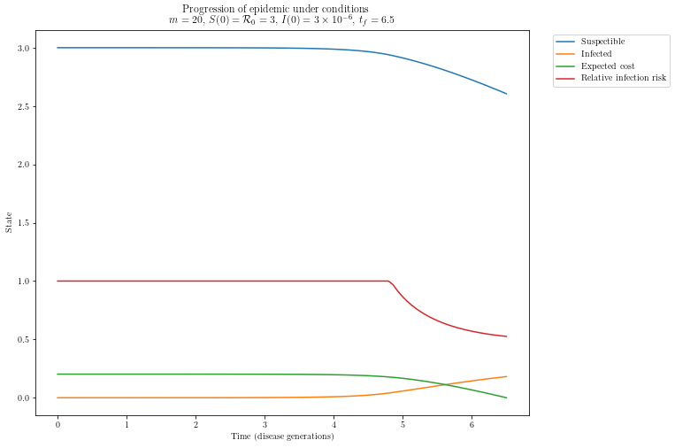

# Introduction

Social distancing includes a variety of actions, each with its own cost to an individual, to maintain physical distance from others and reduce the transmission of a disease. Social distancing also levies economic costs through school and shopping center closures; reliance on remote work; and significant reduction in overall consumption for industries like hospitality and travel.

The existing scholarship on modeling decision-making during an epidemic is diverse. It combines infectious disease dynamics, interaction patterns among a population, and the subsequent choices made by individuals on how to react [@chang2020game]. 

In this paper, I implement a stochastic, classical game theoretic model of social distancing developed by @reluga2010game. By incorporating social distancing as an investment that individuals can either maintain or change through time, this model provides insight on how the optimal social distancing strategy can affect the progression of an epidemic.

# Model

### SIR Model with relative risk

This model builds off of the simple epidemiological Susceptible, Infected, and Recovered (SIR) model. The SIR model compartmentalizes individuals as susceptible, infected and infectious, or recovered. We let X, Y, and Z denote the number of individuals in each of these states, respectively, at a given time. $\beta$ is the transmission rate describing the flow from the susceptible state to infected; $\gamma$ is the removal rate describing the flow from the infected to recovered state, whether through recovering with immunity or passing away. With these two parameters describing transmission and removal rates, we then have a first order system of differential equations describing how an epidemic progresses through time.

\begin{align}
\frac {dX}{dt} &= -\beta YX \nonumber \\ 
\frac {dY}{dt} &= \beta YX - \gamma Y \\
\frac {dZ}{dt} &= \gamma Y \nonumber
\end{align}

In this SIR model, an epidemic begins in a community of size $N = X(0) + Y(0)$ with the individuals in the removed or recovered state, so $Z(0) = 0$. $Y(0) \approx 0$ because epidemics generally begin with a small number of infections, and the basic reproduction number $\mathcal{R}_0 = \beta N / \gamma$. In epidemiology $\mathcal{R}_0$ is a dimensionless number that represents the number of secondary infections caused by one single infection. In order for an epidemic to begin, $\mathcal{R}_0 \geq 1$ [@jones2007notes].

Several assumptions undergird the simple SIR model: first, the population is homogeneous and well-mixed, meaning that individuals interact with one another with the same contact rate [@chang2020game]. Second, both the transmission and removal rates are population averages and remain constant. Diseases that affect people differently based on factors like age or access to healthcare will thus be simplified in this model [@brauer2012mathematical]. Third, the duration of infections is exponentially distributed. Fourth, we assume that the epidemic is fast-moving, meaning that the size of the population is not affected by demographic processes and discounting future values will not be necessary. Lastly, we track the progression of this epidemic on the finite time horizon. We assume mass vaccination at the end of the epidemic $t_f$. The boundary conditions for the infinite time horizon are different and outside the scope of this project.

@reluga2010game extends this SIR model to be a differential game  at the population level; every individual is a player who practices a social distancing strategy. One benefit of a differential game is that strategies are continuous through time; geometrically, they can be represented by a curve rather than set of discrete points. We denote the daily cost or investment into social distancing as $c_s$, and we let $\bar{c_s}$ denote the aggregate daily social distancing strategy. The specific costs, from economic to personal liberty, are reduced to just one measure here. We conceptualize $c$ as a proxy for the stringency to which one practices social distancing: when $c_s = 0$, an individual invests nothing and does not practice social distancing, and an individual with $c_s = 1$ practices social distancing less than an opponent whose $c_2 = 2$. (Note that we use the language "cost," "investment," and "strategy" interchangeably when referring to $c_s$ or $\bar{c}$.)  

With a larger population size, the individual strategy $c_s$ influences neither the aggregate population strategy $\bar{c_s}$ nor the progression of the epidemic. Only the population strategy $\bar{c_s}$ influences how the epidemic proceeds through $sigma(c)$. We let the effectiveness of social distancing, or equivalently, the relative risk of infection, be denoted by $\sigma(c)$. We assume the following functional form for $\sigma(c)$:

\begin{equation}
\sigma(c) = \frac {1} {1+mc} \nonumber
\end{equation}

where $m$ denotes the maximum social distancing efficiency. When $m$ is large, the relative risk of transmission $\sigma'(c)$ decreases more quickly. Several advantages result from assuming this particular form: when there is no investment in social distancing, $c = 0$, and the relative risk of infection $\sigma(0) = 1$. As $c$ increases, $\sigma(c)$ decreases but is bounded below by 0; this is justified because social distancing cannot entirely rule out one's chance of infection. The relative risk of infection can be built into equation (1) by interacting with the transmission rate $\beta$. The transmission rate can thus be reduced with a lower relative risk, decreasing the overall flow of individuals from the susceptible to infected states. Also, $\sigma(c)$ is well-behaving, meaning that it is differential, strictly convex, and decreasing.

\begin{align}
\frac {dX}{dt} &= -\sigma(\bar{c_s})\beta YX \nonumber \\ 
\frac {dY}{dt} &= \sigma(\bar{c_s}) \beta YX - \gamma Y \\
\frac {dZ}{dt} &= \gamma Y \nonumber
\end{align}

Next, we create a nondimensional version of the system (3) to simplify our subsequent analyses. We let the population in each state be relative to the critical population size necessary for the epidemic to be sustained, with the constant factor of $\beta / \gamma$ relating to $\mathcal{R}_0$. Next, we let the social distancing strategy be relative to the daily cost of infection $c_I$ which will provide convenient benchmarks when incorporating equilibrium game analysis in the next section. This dimensionless $c$, however, is not bounded by 1 because an aggregate social distancing strategy that is more expensive than the cost of being infected may actually be more optimal due to the effect of curbing the epidemic. Lastly, we let time to be relative to disease generations. We thus take on the following substitutions:

\begin{equation}
\begin{gathered}
S = \frac {\beta}{\gamma} X, \ I = \frac {\beta}{\gamma} Y, \ R = \frac {\beta}{\gamma} Z \\
\hat{t} = \gamma t, \ c = \frac {c_s}{c_I}, \ \hat{\sigma}(c) = \sigma(c_1c)
\end{gathered}
\end{equation}
  
We substitute these nondimensional values into equation (3). For ease of notation, we drop the hat notation for $t$ and $\sigma(c)$. 

\begin{align}
\frac {dS}{dt} &= -\sigma(\bar{c}) IS \nonumber \\ 
\frac {dI}{dt} &= \sigma(\bar{c}) IS - I \\
\frac {dR}{dt} &= I \nonumber 
\end{align}

where $c \geq 0$. This system of first order differential equations thus describes the progression of the epidemic from one state to the other. The boundary conditions of this system can be derived by considering how epidemics typically begin: the majority of the population is in state $S$ at the onset of the epidemic, and the infected cases are very few. Thus, $I(0) \gtrapprox 0$ and $S(0) \approx \mathcal{R}_0$. The latter condition results from the definition of $\mathcal{R}_0 = \frac {\beta}{\gamma}N = \frac  {\beta}{\gamma}(S(0) + I(0))$ and the very small fraction of the population made up by infected cases. The third boundary condition will be derived with further analysis.

### Social distancing game

Exactly what determines an individual's social distancing strategy? By modeling social distancing as a differential game, we can conceptualize $c = c(t)$ because of each player's strategy is continuous through time. To find the equilibrium strategy $c^*$, we augment our model to quantify the value, of expected payoff, of social distancing. By incorporating expected payoff, we will then be able to parametric $c$ explicitly, $c = c(S, I)$ and implicitly, $c = c(V_S, I)$ through the value of being in the susceptible state.

In the game of social distancing, each player is acting on a certain strategy $c_s$ at any given time $t$. The population-level social distancing game thus involves a player's continuous trade off between a strategy with greater cost $c_s$ for a reduction in risk of infection. This can be modeled with a continuous time Markov chain. We let $\mathbf{p}(t) = \left( \begin{array}{ccc} p_S(t), & p_I(t), & p_R(t) \end{array} \right)^T$ denote a probability vector for a player being in the epidemic states $S$, $I$, or $R$ (susceptible, infected, or removed state) at time $t$. The following Markov process then governs how $\mathbf{p}(t)$ changes with time:

\begin{align}
\mathbf{\dot{p}}(t) = Q(t; c)\mathbf{p}(t)
\end{align}

where $c$ is a function of the epidemic state variables $S$ and $I$ and represents the individual daily investment in social distancing. $Q(t; c)$ describes the transition-rate matrix from one state to the next and is taken directly from equation (4).

\begin{align}
Q(t; c) = \left( \begin{array}{ccc}  
            -\sigma(c)I & 0 & 0 \\ 
            \sigma(c)I & -1 & 0 \\ 
            0 & 1 & 0 \end{array} \right)
\end{align}

As we are modeling a stochastic process, calculating the time spent in each state or the precise payoff is not feasible. As a result, we calculate the expected present values for each epidemic state at a given time and strategy $c$ by considering the probabilities of future events. Because we assume earlier that the epidemic is faster than demographic processes, we set a discount rate of zero, so discounting is precluded from our formulation of expected values. 

We let $\mathbf{V} = \left( \begin{array}{ccc} V_S(t; c, \bar{c}) & V_I(t; c, \bar{c}) & V_R(t; c, \bar{c}) \end{array} \right)^T$ relay the expected values of being in each state at time $t$ when the individual is employing strategy $c$ and the population aggregate strategy is $\bar{c}$. In later analysis, we will maximize the payoff of being in the susceptible $V_S$ to determine the optimal social distancing strategy. To find how the expected value $\mathbf{V}$ evolves, we use the following adjoint equations:

\begin{align}
-\mathbf{\dot{V}} = Q^T\mathbf{V} + \mathbf{v}
\end{align}

where $\mathbf{v}(t; c) = \left(-c(t), -1, 0 \right)^T$. When plugging in $Q(t; c)$ from equation (7) to the adjoint equations describing expected values of each state in equation (8), we have the following set of adjoint equations that describe the value of each state

\begin{align}
-\frac {dV_s}{dt} &= (V_I - V_S)\sigma(c)I-c \nonumber \\ 
-\frac {dV_I}{dt} &= V_R - V_I - 1 \\ 
-\frac {dV_R}{dt} &= 0 \nonumber 
\end{align}

with $c \geq 0$ for all time $t$. For the purposes of this paper, we assume that a vaccine is discovered and made available at time $t_f$, when the epidemic will end. Although the assumption of immediate mass vaccination once available is unrealistic, the exact dynamic of how an epidemic ends is not the main question of this model. From the last two equations in system (9), we obtain the solutions that $V_I(t_f) = -1$ and $V_R(t_f) = 0$. We also observe that the epidemic progression is independent of R, so we have the following reduced system

\begin{align}
\frac {dS}{dt} &= -\sigma(\bar{c}) IS \nonumber \\ 
\frac {dI}{dt} &= \sigma(\bar{c}) IS -  I \\
-\frac {dV_s}{dt} &= -(1 + V_S)\sigma(c)I-c \nonumber 
\end{align}

with boundary conditions

$$
\begin{gathered}
S(0) = S_0 = \mathcal{R}_0, \ I(0) = I_0 \gtrapprox 0,\ V_S(t_f) = 0.
\end{gathered}
$$

We thus have a first order system of three differential equations and three corresponding boundary value conditions, two for the initial time and one for the terminal time. Note that we no longer consider the flow to recovered individuals because the progression of the epidemic is independent of $R$. Once the equilibrium $\bar{c}$ value is found, we can use standard numerical techniques to solve this system as a boundary value problem. The expected total cost of the epidemic to an individual will be given by $V_S(0)$.

### Equilibrium social distancing strategy

In this social distancing game, each individual's strategy is represented by $c$, the cost or investment incurred each day by social distancing. To solve the reduced system of equations (10), we find equilibrium strategies that maximize the each player's payoff $V_S(t; c, \bar{c})$ regardless of the strategies taken on by other players. Intuitively, the Nash equilibrium strategy is one in which the individual is most well-off, even when considering opponents' strategies and the alternative strategies available to the player.

Mathematically, the equilibrium solution $c^*$ satisfies the following inequality for any value of $c$: $V_S(t; c, c^*) \leq V_S(t; c^*, c^*)$. The first cost argument of $V_S$ is the individual's cost $c$-- at any point in time, this individual would do better with strategy $c^*$ than any other. The second cost argument of $V_S$ is the population strategy $\bar{c}$. On both sides of the inequality, the population strategy is  $c^*$. This is because the nature of an equilibrium solution maximizes the value of being in the susceptible state, so other players adopt the strategy $c^*$ and the aggregate social distancing strategy is $c^*$. To summarize, the population level social distancing game is at equilibrium when an individual employs strategy $c^*$ because all alternative strategies for $c$ do not make the individual better off. The population investment in social distancing thus also is $c^*$.

To calculate $c^*$, we implement a greedy algorithm that maximizes an individual's rate of increase for their expected value $V_S$. We find $c^*$ implicitly by parametrizing it in terms of $V_S$ and $I$, using the last equation in system (10). $c(V_S, I)$ is the cost of social distancing at a disease generation $t$ when the epidemic is at a state $V_S$ and $I$. If $c^*(V_S, I)$ is an equilibrium strategy, then it satisfies the following principle

\begin{align}
c^*(V_S, I) &= \argmax_{c \geq 0} \frac {dV_S}{dt} = \argmax_{c \geq 0} -(1 + V_S)\sigma(c)I-c
\end{align}

when $\bar{c} = c^*$. Because we assume a function form of $\sigma(c)$ that is differentiable, decreasing, and strictly convex, then we can solve for $c^*$ that maximizes the rate of increase for an individual's expected payoff. To do so, we first note that, as one's strategy changes, the rate of increase for their expected payoff changes as follows: 

\begin{align}
- \frac {d} {dc} \frac {dV_s}{dt} = -\sigma'(c)(1+V_s)I - 1.
\end{align}

When expression (12) is not equal to zero, then, $c^* = 0$ because changes in $c$ do not maximally increase $V_S$. When expression (12) is equal to zero, then, $c^*$ is indeed the value satisfying equation (11). Thus, we can find $c^*$ defined as such:

\begin{align}
\left\{ \begin{array}{cc}
  c^* = 0 & \hspace{15mm} \text{if  } \frac{d}{dc} \frac{-dV_s}{dt} \leq 0\\
  c^* \text{ such that  } \frac{d}{dc} \frac{-dV_s}{dt} = 0 & \hspace{15mm} \text{else}
\end{array} \right.
\end{align}

Solving for $c^*$ involves root finding for a quadratic equation; to avoid catastrophic cancellation from subtracting finite precision numbers of similar magnitude, we refer to the common numerically stable method for quadratic root finding which finds that root for the inverse of the original quadratic equation.

I implement this model using scipy, namely solve_bvp, in Python to find solutions for this system when players play according to their equilibrium strategy. While @reluga2010game uses the shooting method to find the solution, I solve the system with the boundary conditions for $S(0) = \mathcal{R}_0$, $I(0) = I_0$, and $V_S(t_f) = 0$. Our parameter choice also reflects what the paper used: $m = 20$, $t_f = 8.6, 6.5$, $S(0) = \mathcal{R}_0 = 3$, and $I(0) = 3 \times 10^{-6}$. We expect the different methods to produce same results for this model.
 
# Results

The first set of plots, Figure 1 and Figure 2, show the progression of an epidemic when mass vaccination is available at $t_f = 8.6$ and $t_f = 6.5$. Both simulated epidemics begin with no social distancing. As the size of the susceptible population begins to dip (and the infected population begins to grow), social distance strategies are adopted. When the epidemic lasts longer, an equilibrium strategy that involves some amount of social distancing begins earlier -- we observe this by noting the dip in the relative risk of infection which signifies when $c^*$ is no longer zero. 

The epidemic that lasts longer also has a greater $V_S(0) \approx .5$ than when it is shorter, $V_S(0) \approx .2$. This can be interpreted to mean that under equilibrium social distancing strategies, the population saves 50% and 80% per capita, respectively, for epidemics that last for 8.5 and 6.4 generations.

{width=500px}

{width=500px}

Next, we consider the trajectories of the relative risk of infection under equilibrium strategies when varying $t_f$, the number of disease generations before a vaccine is made available. Figure 3 demonstrates that for an epidemic lasting less than 40 disease generations, social distancing continues until the end of the epidemic. When the length of an epidemic increases beyond then, as indicated by when $t_f = 42$, the equilibrium strategy returns to no social distancing. The relative risk of infection remains one at the start of these epidemics, indicating that social distancing is not practiced initially, but the risk drastically decreases after around five disease generations.

{width=500px}

{width=500px}

Lastly, we consider how changes in $m$, the effectiveness of social distancing, and the length of an epidemic influences the per capita cost of the epidemic, which is given by $V_S(0)$. As the length of time that an epidemic lasts increases, so does the cost of the epidemic. As the effectiveness of social distancing decreases, the cost of the epidemic increases as well. 

# Discussion

One crucial difference between this project and the original paper is the method of solving equation (9). @reluga2010game uses the shooting method, which involves trying out different values of $S(t_f)$ and using scalar root finding to identify the value of $S(t_f)$ that matched the appropriate $S(0)$. Likely due to the different methods of solving the solution, figures 1 and 2 in this paper do not match figure 5 in the original paper regarding the length of an epidemic and the time in which social distancing is adopted -- in the original paper, the shorter the epidemic, the earlier the equilibrium strategy includes social distancing. 

Another problem with solving equation (9) with the boundary value approach is the instability of solutions under different values of $t_f$ and choices of time steps, the latter of which is concerning because arbitrary changes in time steps to numerically calculate the solution can cause the solution to blowup. Regarding the instability of tracking the epidemic under different $t_f$, figure 5 and 6 both demonstrate this problem; unstable solutions become more common as $t_f$ become greater, but also occur at shorter epidemic lengths like $t_f = 24$. 

The choice in time steps refer to the first call of scipy's solve_bvp: the initial guess for $y$ (for a generalized system of differential equations $y' = f(y, t)$) must have the same number of estimates as the time steps, so most examples including the documentation choose small time steps like 5. When I adjust the number of time steps in the first call of solve_bvp, the $t_f$ values that generate unstable solutions change as well. Investigating the cause of this discrepancy may also resolve the different in epidemic results.

The future work for social distancing as a differential game is quite fruitful. The relative risk of transmission can be applied to more complicated models, from the Susceptible, Exposed, Infected, Recovered (SEIR) model to models specific to the coronavirus. Complicating the original epidemiological model can also address the simplified $\beta$ and $\gamma$ that are population averages. Infinite time horizons and the generalized utility function for the game are two other areas of future work.

{width=300px}

{width=300px}

{width=300px}

# References